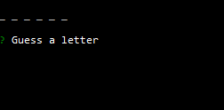
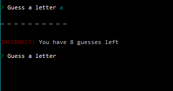
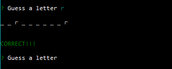
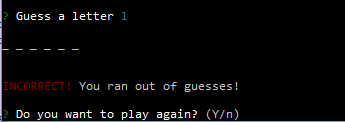

# Constructor Hangman using Node

### Overview

This is a hangman command-line game using constructor functions.

### Node Packages
 This app uses inquirer and colors node packages (see package.json)

## Instructions

1. Download or clone the repository.
2. Install the node packages by running `npm install` in the terminal.
3. To start the game, run `node hangman-cli.js` in the terminal.

Running the program will cause a word to be chosen, and the corresponding number of dashes to appear on the screen along with a prompt asking the user to guess a letter.

The hangman game continues as usual.

If the guessed letter is not in the word, the player loses a guess. The game will inform the user that the guess was incorrect, display how many guesses are remaining, and prompt the user to guess a new letter.

If the letter is in the word, the number of guesses left remains the same. The game will inform the user that the guess was correct, display those letters in their position in the word instead of the dashes, and prompt the user to guess a new letter. 

When the game is over the game will inform the player whether they won (by guessing all the letters in the word) or lost (by running out of guesses) and will ask the user if they want to play again or not. 

If they answer yes, a new word will be chosen and a new round will begin.

